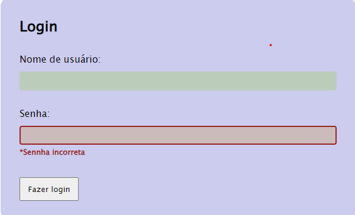

## Formulário de Login
Este projeto consiste em um formulário de login desenvolvido com HTML, CSS e JavaScript. O objetivo é simular a interação de um usuário com o formulário, aplicando estilos dinamicamente por meio de classes CSS.

## Funcionalidades
Alteração de estilo do título "Login" usando JavaScript:

## Imagem.

Cor do texto alterada para vermelho.
Cor do plano de fundo alterada para violeta.
Alteração de estilo do botão usando JavaScript:

Cor do texto alterada para verde.
Cor do plano de fundo alterada para roxo (#5826E6).
Alteração de estilo dos nomes de usuário usando JavaScript:

Cor do texto alterada para amarelo (#F5FA87).
Alteração de estilo dos campos de input usando JavaScript:

Cor do plano de fundo alterada para vermelho (#F74D4A).
Simulação de erro no nome de usuário:

Adição da classe "error" ao elemento do nome de usuário.
Adição da classe "visible" ao elemento de mensagem de erro correspondente.
Correção do nome de usuário:

Adição da classe "correct" ao elemento do nome de usuário.
Simulação de erro na senha:

Adição da classe "error" ao elemento da senha.
Adição da classe "visible" ao elemento de mensagem de erro correspondente.
Tecnologias utilizadas
HTML
CSS
JavaScript
Como executar o projeto
Faça o download dos arquivos do projeto.
Abra o arquivo index.html em um navegador web compatível.